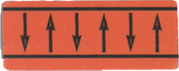
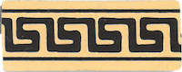
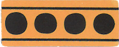
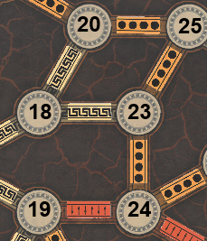

# Agamemnon

## Purpose

This was the major group project for the COMP1140 course I took at ANU 2019. Using Java and JavaFX, we implemented the board game [Agamemnon](https://ospreypublishing.com/agamemnon),
designed by Günter Cornett and made by games developer [Osprey Publishing](https://ospreypublishing.com/).
[Board Game Geek provides a description of Agamemnon](https://boardgamegeek.com/boardgame/193693/agamemnon), including images of the components. Moreover, we had developed an agent to play the game, which used Monte Carlo Simulation. It also happened to come first in the internal elimination tournament held by our very cool course convenors, Professor Steve Blackburn and Dr Josh Milthorpe, winning all games 5-0. Everything from here on is part of the original README written by the course instructors, and you can look at the commit history for the original README.

### Game Rules 

Agamemnon is a two-player game in which the players compete to win the Trojan War by controlling the *Strings of Fate* that span across the board.
For a complete description, and in case of any ambiguities in the assignment description,
consult the game rules which are distributed with the published game.

#### Strings of Fate

Spaces (nodes) on the board are connected by edges of three different types: *Strength* (red), *Leadership* (white), and *Force* (yellow).
A *String of Fate* is a connected set of edges of the same type.

Strength strings are won by the player with the highest combined strength in tiles on connected nodes.

Leadership strings are won by the player with the highest-ranked Leader tile on any connected node.

Force strings are won by the player with the most tiles on connected nodes.

For example, in the image below, a Force string connects nodes 20, 25, 23, and 24;
a Leadership string connects nodes 20, 18, and 23;
and a Strength string connects nodes 19 and 24.
(Other nodes are also connected, but they can't be seen in this image as it only shows part of the board.)

#### Tiles

There are four types of tiles.

*Warrior* tiles have a strength of one, two, or three; 
each player has three Warrior tiles of strength one, 
two Warrior tiles of strength two,
and one Warrior tile of strength three.

Each player has five *Leader* tiles, which have both a strength and a rank.
The highest-ranked Leader tile is 'a' and the lowest is 'e'.
When Warrior and Leader tiles are placed, they simply remain in place until the end of the game.

Finally, each player has two *Weft* tiles and two *Warp* tile.
Wefts and Warps do not have a strength or leadership rank, but they do count towards force.
When a *Weft* tile is placed, it breaks any Strings of Fate that would have connected through that node,
i.e. the edges on either side of the node are now considered to belong to separate Strings of Fate,
and the Weft is connected to each of the Strings separately.
When a *Warp* tile is placed, the player who placed it chooses two of the neighbouring edges and switches them,
thereby altering the Strings of Fate.

If a player draws a Weft or a Warp tile during their first two turns, 
they may replace it, shuffle their tiles, and choose another tile.

#### Game Play

Players take turns to select tiles and place them on empty spaces on the board.
The players' tiles are placed face down (so they can't be seen) and tiles are randomly selected.
On the first turn, the first player selects a tile and places it on a chosen space on the board.
On subsequent turns, each player randomly selects two tiles and then places them in either order on empty spaces on the board.
On the final turn, the second player places a single tile in one of the remaining empty spaces 
(there will always be two empty spaces remaining on the board at the end of the regular game,
or three empty spaces in the [Loom Variant](#The Loom)).

The game ends when the final tile has been placed, and the score is calculated.
Each String of Fate that is won by a player counts towards that player's score according to the number of edges it contains.
In case of a tie for a String of Fate (for example, both players have the same combined strength on a strength String), neither player receives points for that String.
In the case of a tie for the highest-ranked Leader on a leadership string, the next highest-ranked Leader tiles for each player are compared and so on until a winner is found or there are no more Leader tiles to compare.
The player with the highest score (that is, the highest number of edges controlled) wins the game;
in case of equal scores, the game is declared a tie.
